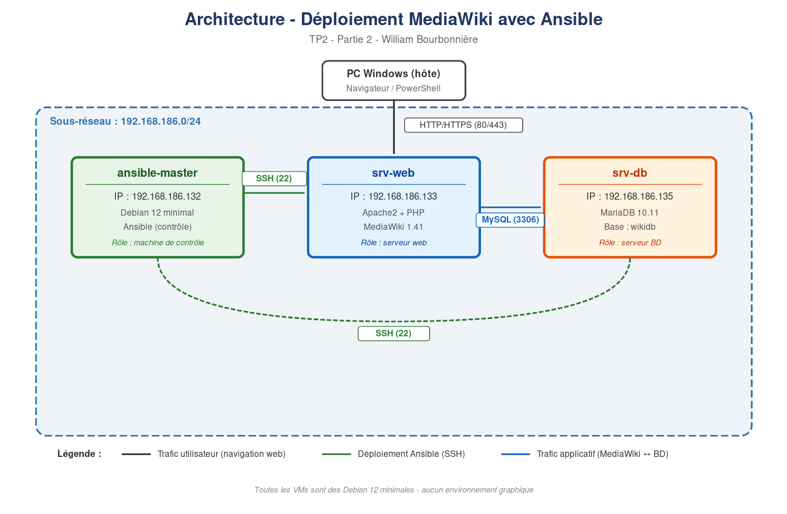

# Architecture

## Overview

The project deploys a three-tier MediaWiki stack across three Debian 12
virtual machines, with a client workstation making HTTP/HTTPS requests
from outside the subnet.

## Hosts

| Hostname         | Role                  | Services                      |
|------------------|-----------------------|-------------------------------|
| `ansible-master` | Control node          | Ansible CLI, SSH client       |
| `srv-web`        | Web / application tier| Apache 2.4, PHP 8, MediaWiki  |
| `srv-db`         | Database tier         | MariaDB 10.11, `wikidb`       |

All three VMs run **Debian 12 (bookworm)** minimal, with no graphical
environment.

## Network flows

| Source           | Destination      | Protocol  | Port  | Purpose                  |
|------------------|------------------|-----------|-------|--------------------------|
| Client PC        | `srv-web`        | HTTP/HTTPS| 80/443| User-facing wiki browsing|
| `ansible-master` | `srv-web`        | SSH       | 22    | Ansible deployment       |
| `ansible-master` | `srv-db`         | SSH       | 22    | Ansible deployment       |
| `srv-web`        | `srv-db`         | TCP       | 3306  | MediaWiki to MariaDB     |

## Trust boundaries

1. **External -> Web tier** — the only publicly exposed surface. Apache
   is hardened with TLS, security headers (HSTS, X-Frame-Options),
   `ServerTokens ProductOnly`, and protected by ModSecurity + Fail2ban.

2. **Web tier -> Database tier** — application-layer trust. MariaDB
   accepts the `wikiuser@%` account, which has privileges only on
   `wikidb.*` (principle of least privilege).

3. **Control plane** — SSH key-based authentication from `ansible-master`
   to the target hosts. The private key remains exclusively on the
   control node. In production this machine would sit behind a bastion
   or be a dedicated ephemeral runner.

## Why a 2-VM deployment for MediaWiki

Separating the web and database tiers onto different hosts reflects a
realistic production pattern:

- Allows independent scaling (more web capacity without touching the DB)
- Enables OS-level isolation (different attack surfaces)
- Forces explicit network design (MySQL port across hosts, not local socket)
- Makes the Ansible playbook demonstrate cross-host variable resolution
  (`hostvars['srv-db'].ansible_host` in the MediaWiki install task)
